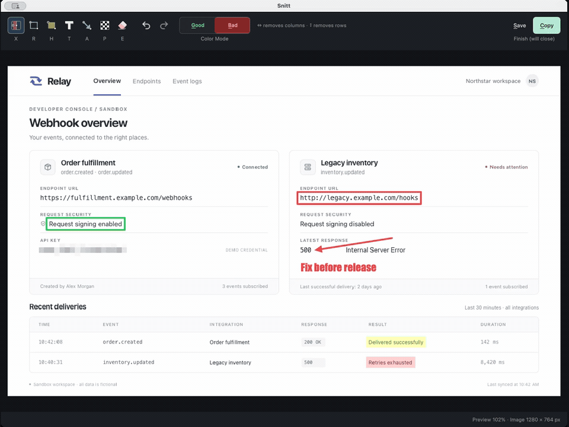

# Snitt

A small screenshot and screen-recording app for macOS and Windows. Select a region,
edit or combine screenshots, or record a video. Nothing is uploaded.

Snitt stays in the macOS menu bar or Windows system tray. **Ctrl+Print Screen**
starts a capture from any app; on macOS with a PC keyboard, use **Control+F13**
(the Control key).



## Install

### macOS 15+ · Apple silicon

```sh
brew tap isaksky/snitt https://github.com/isaksky/snitt.git
brew install --cask isaksky/snitt/snitt
```

Open `Snitt.app` and grant screen-recording permission when prompted. The app is
not notarized, so macOS may require approval on first launch. Qt and media helpers
are bundled. To start at login, add Snitt in System Settings → General → Login Items.

Quit Snitt before updating:

```sh
brew update
brew upgrade --cask isaksky/snitt/snitt
```

Uninstall with `brew uninstall --cask isaksky/snitt/snitt`.
For a source build, see [development](docs/development.md).

### Windows 10/11 x64

With [Scoop](https://scoop.sh/) installed:

```powershell
scoop bucket add snitt https://github.com/isaksky/snitt.git
scoop install snitt/snitt
```

Scoop installs Qt, FFmpeg, and a login entry. Quit Snitt before updating with
`scoop update snitt`; uninstall with `scoop uninstall snitt`.
Windows binaries are unsigned. Video recording requires Windows 10 version 2004
(build 19041) or later.

For a standalone install, download the Windows ZIP from the
[latest release](https://github.com/isaksky/snitt/releases/latest), extract it, and
run **Install.cmd**. It installs into `%LOCALAPPDATA%\Programs\snitt` with a Start
menu shortcut and login entry; no administrator rights are needed. Install FFmpeg
for recording with `scoop install ffmpeg`. Run **Uninstall.cmd** in the installed
folder to remove Snitt. Uninstall the standalone app before switching to Scoop.

## Settings

| Platform | Settings file |
| --- | --- |
| macOS | `~/Library/Preferences/snitt/snitt/settings.ini` |
| Windows | `%LOCALAPPDATA%\snitt\snitt\settings.ini` |

See the [settings guide](docs/settings-format.md) for shortcuts, colors, and save
folders. A copy of the guide lives beside `settings.ini`; edits reload automatically.

## Development

- [Build, run, and test](docs/development.md)
- [Code map](docs/code-map.md)
- [Release guide](docs/releasing.md)

Snitt's original code is [MIT licensed](LICENSE). Third-party code and bundled
dependencies retain their own licenses; see [OMACUT notices](src/OMACUT-LICENSE)
and [icon notices](src/icons/LICENSE).
