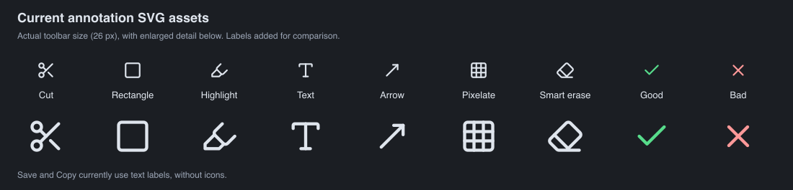
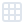

# Annotation icon design

This is the original design discussion. The [implemented icon set](annotation-icons.md)
uses the approved v1 gesture geometry and includes a contact sheet of the finished toolbar.

Editable design brief for seven custom xshot annotation icons. Edit the proposed descriptions directly or use the **Your edits** lines. The images show the **current icons**; the proposed custom artwork is described below.

## Current icons at a glance

The contact sheet uses the actual existing SVG shapes. Individual source previews are included below; their pale strokes are easiest to see against a dark background.

## Shared visual direction

- **Style:** colored, lightly dimensional illustrated tools. Use simple shapes, restrained shading, and a consistent upper-left light source.
- **Size:** design for the actual 26 px toolbar icon. Keep silhouettes, gaps, and major color areas readable at that size; use a consistent visual weight and generous space around each icon.
- **Material:** one subtle highlight or shadow edge can suggest depth. Avoid tiny textures, glossy glare, heavy drop shadows, and excessive detail.
- **Background:** transparent artwork that reads clearly on the dark toolbar (`#1b1e23`) and its selected-state background (`#283b50`).
- **Colors:** tool colors describe the objects. The user's configurable Good/Bad colors remain annotation-mode colors; switching modes should not recolor every tool icon.
- **States:** a consistent button background/border identifies the selected tool. Disabled controls remain clearly distinguishable. Tooltips retain the tool name and configured shortcut.
- **Assets:** a cohesive set of editable SVGs, checked at normal and high display scaling. Preserve each icon's own colors when integrating with Qt.

**Your edits to the shared style:** _Add or change anything here._

## 1. Cut

**Current icon:** scissors

**What the tool does:** removes an internal full-height column or full-width row from the image and joins the remaining edges. The drag direction determines which kind of strip is removed.

**Proposed custom appearance:** a small blue image tile with an amber vertical strip being removed from its middle. The two remaining sections visibly come together, using a simple inward cue if it remains clear at 26 px. This should communicate **remove a strip and join**, rather than clipboard cut or ordinary crop. This concept is already approved in principle; the exact shape can be refined.

**Your edits:** _…_

I think it should have a hollow circle in the left middle indicating a starting point, then a solid circle in the middle (hor + vert) indicating the endpoint. Then a dotted line going down the middle, indicating the cut line. Then a rectangle with faint red diagonal slash lines "fill" indicating the region that would be cut.

## 2. Rectangle

**Current icon:** rounded outline square

**What the tool does:** draws an unfilled rectangle in the selected annotation color and stroke width.

**Proposed custom appearance:** a blue hollow rectangular frame, with a restrained lighter upper edge suggesting a little depth. Keep the center visibly empty and the outline substantial enough to recognize immediately.

**Your edits:** _…_

I think it should have a hollow circle in the top left indicating a starting point, then a solid circle in the bottom right indicating the endpoint.

## 3. Highlight

**Current icon:** outline chisel-tip highlighter

**What the tool does:** fills a dragged rectangular area with translucent highlighting. Current Good mode uses yellow and Bad mode uses red; overlapping highlights accumulate.

**Proposed custom appearance:** a yellow chisel-tip marker touching a short translucent yellow stripe. Give the marker a simple body and one shading edge. Keep its narrower marker silhouette distinct from the broader Smart erase rubber. The yellow is the tool's illustration color, not a promise that every highlight will be yellow.

**Your edits:** _…_

I think it should have a point in the top left indicating a starting point, as well as a little yellow rectangular streak.

## 4. Text

**Current icon:** serif T

**What the tool does:** places a text-entry area for multiline screenshot annotation; font size and annotation color are adjustable.

**Proposed custom appearance:** a solid ivory **T** with a subtle slate side edge, like a small dimensional letter. Use a bold, simple silhouette that survives at toolbar size. This icon does not need to reproduce the annotation font exactly; Impact is covered by a separate requested font change.

**Your edits:** _…_

## 5. Arrow

**Current icon:** northeast-pointing outline arrow

**What the tool does:** draws an arrow from the drag's starting point toward its ending point, using the selected annotation color and stroke width.

**Proposed custom appearance:** a blue diagonal arrow with a filled head and a restrained lighter upper edge. Match Rectangle's blue/material treatment. Use a strong shaft and head; avoid a surrounding box that could imply opening an external link.

**Your edits:** _…_

## 6. Pixelate

**Current icon:** bordered 3×3 grid

**What the tool does:** replaces the selected image area with coarse blocks of averaged image color. The mouse wheel changes block size.

**Proposed custom appearance:** a compact, borderless mosaic of about five to seven filled square tiles in blue, amber, and lavender, with a mix of larger and smaller squares. Leave clear gaps and an irregular outer silhouette. Subtle tile shading can match the other icons. Avoid enclosing lines or a uniform table grid.

**Your edits:** _…_

## 7. Smart erase

**Current icon:** diagonal outline eraser on a baseline

**What the tool does:** fills the dragged rectangle with the exact image color sampled at the start of the drag, including transparency. It is a flat sampled-color fill, not generative object removal.

**Proposed custom appearance:** a pale pink rubber eraser with a cream sleeve, touching the end of a small dark mark. Use a broad, recognizable eraser shape with modest shading. Keep it visually distinct from the yellow marker. Do not add an AI sparkle or imagery suggesting reconstructed image detail.

**Your edits:** _…_

## Controls around the icons

Good/Bad keep their check/cross symbols and text in the joined control under the centered **Mode** heading. **Save** and **Copy** stay separate text actions under the centered **Finish (will close)** heading, with Copy emphasized. These controls are outside the seven custom artwork assets.

**Any other changes you want:** _…_
