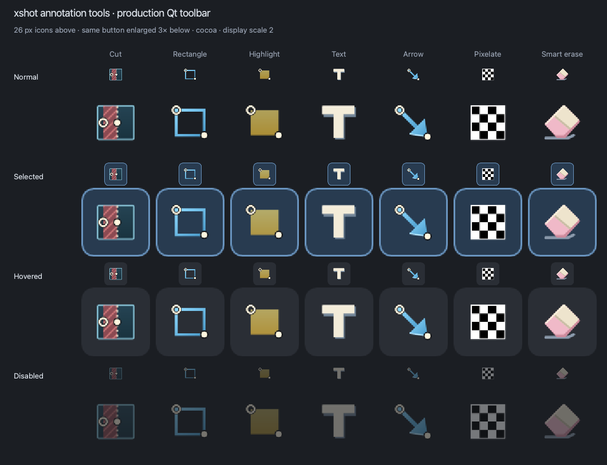

# Annotation icons

The seven custom SVGs live in [`src/icons/annotation`](../src/icons/annotation).
Each has a transparent 32 × 32 canvas, rendered at 26 logical pixels in the
40-pixel toolbar buttons. The tool order is Cut, Rectangle, Highlight, Text,
Arrow, Pixelate, and Smart erase.

The contact sheet shows each production button at its logical size and enlarged
three times for inspection. It was captured from the native macOS Qt toolbar at
200% display scaling; the enlarged examples magnify the captured pixels.

## Artwork

- Cut, Rectangle, and Highlight reuse the approved
  [v1 SVGs](assets/annotation-icons-v1/) unchanged. A hollow
  circle marks mouse-down; a solid circle marks mouse-up. Cut's full-height red
  band reaches its dashed boundary at x=17, and Highlight's yellow rectangle
  reaches both gesture coordinates. Region, boundary, and marker drawing order
  preserves their contact without a gap.
- Text is an ivory T with a slate side edge. Arrow shares Rectangle's blue
  palette and gesture markers: a hollow circle at the top-left tail and a solid
  circle at the bottom-right tip, with a filled blue arrowhead between them.
- Pixelate is a simple four-by-four checkerboard of black and white squares.
- Smart erase is a broad pink rubber eraser with a cream sleeve touching a
  visible slate mark. Its illustration does not imply reconstructed detail;
  the tool fills with the exact color sampled at the start of the drag.

The editable paths, shapes, and gradients are packaged by `src/resources.qrc`.
No bitmap or external icon service is used at runtime. The original
[design brief](annotation-icon-design.md) and
[generation prompt](annotation-icon-generation-prompt.md) remain as historical
references; the approved v1 geometry takes precedence over earlier proposals.

## Toolbar integration

Only the annotation-tool delegates override `icon.color` to `transparent`, so
Qt preserves their intrinsic colors. Seven-pixel horizontal padding leaves the
full 26 pixels available inside each button. Disabled buttons use 40% opacity;
the existing selection border/background and hover background identify the
other states. Decorative icon colors are independent of configured Good/Bad
annotation colors.

The shared `ActionButton` tint remains in place for other controls. Good and Bad
are text-only buttons with a solid underline beneath their first letter while
the corresponding G or B shortcut is enabled. Remapped or disabled shortcuts
remove the underline. Color Mode and Finish labels sit below their buttons;
each annotation tool has its shortcut beneath the icon. Copy and Save have the
same 40-pixel height.

Undo/Redo sit beside the drawing tools. The concise tool hint sits between
Color Mode and Finish. The toolbar wraps into two rows at narrow widths. The
annotation view's footer contains only preview zoom and image dimensions;
its former action buttons are removed. Tool actions, tool order, shortcut
bindings, tooltips, accessible names, and Save/Copy behavior are unchanged.

## Verification

The final toolbar was visually checked on macOS (Qt 6.11.1) at 100% and 200%
display scaling, including normal, selected, hovered, and disabled icon states.
The Windows toolbar was also checked in the interactive desktop at 100% scaling.
The Mac and Windows editor, image-tool, and recording suites pass. Layout checks cover
shortcut captions, labels below buttons, equal Save/Copy heights, Undo/Redo
behavior, and hints staying between their neighboring groups at wide and narrow
window sizes.

- `qmlLoadsAndPlacesText`
- `qmlAnnotationToolbarResponsiveLayout` (including accessible names)
- `qmlKeyboardCommands`
- `settingsUpdateEditorShortcutsHintsAndColorsLive`
- `settingsShortcutAlternativesAndDisable`

The previews use the production `Main.qml` buttons. They are review artifacts,
not screenshot assertions.
